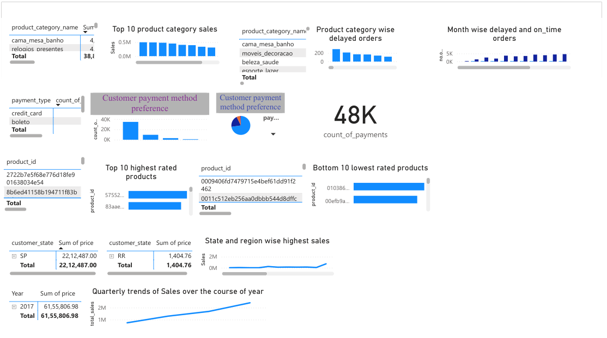
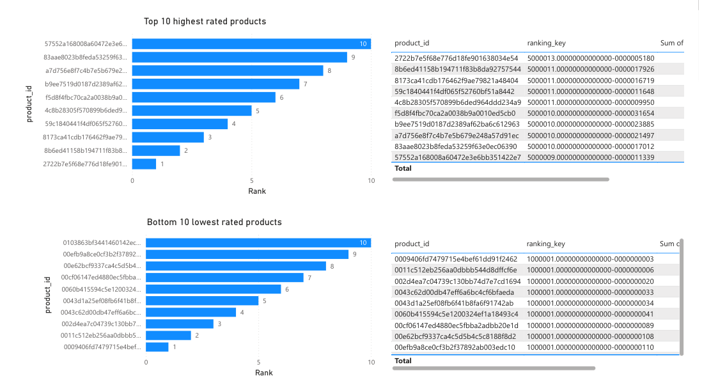
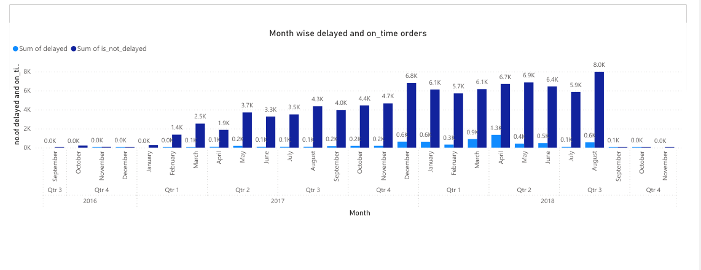

# E-Commerce Sales Performance Dashboard

## Problem
Business required consolidated visibility into sales performance, customer experience, payment behaviour, and delivery delays across regions to support data-driven decision-making.

## Data
Retail marketplace dataset (Shop Nest Store, Portugal) consisting of 9 interconnected datasets covering orders, sales, payments, customers, and ratings.

## Analysis & KPIs
Revenue, YoY growth, order trends, delivery delays (~12%), payment method mix, top and bottom product categories, regional and seasonal performance.

## Outcome
Identified high- and low-performing product categories, quantified delivery delays, uncovered geographic and seasonal sales patterns, and highlighted ~18% YoY revenue growth. Delivered an interactive dashboard enabling real-time monitoring of KPIs and operational bottlenecks.

## Tools
Power BI (Power Query, Data Modelling, DAX)

## Dashboard Preview

